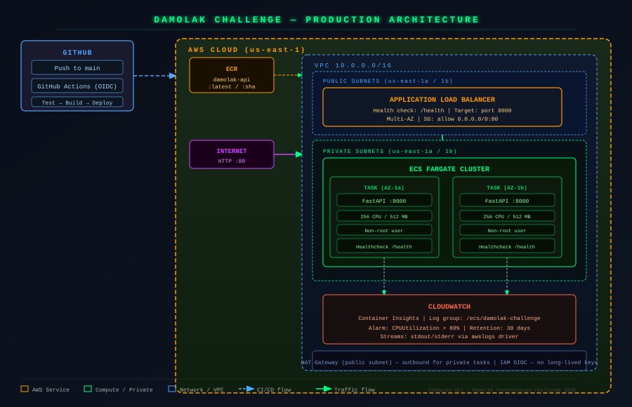

# Damolak Technologies — DevOps Engineer Practical Challenge

**Submitted by:** Chibuike Obi  
**Duration:** 96-hour assessment  
**Stack:** FastAPI · Docker · Terraform · ECS Fargate · GitHub Actions (OIDC) · CloudWatch

---

## Architecture Overview



```
Internet → ALB (public subnets) → ECS Fargate Tasks (private subnets)
                                        ↓
                              CloudWatch (logs + metrics)

GitHub (push to main)
  → GitHub Actions (OIDC — no static keys)
    → Test → Build → Push ECR → Deploy ECS (rolling, zero-downtime)
```

**VPC design:** 2 public subnets (ALB + NAT Gateway), 2 private subnets (ECS tasks), across 2 AZs. Tasks have no public IPs — all outbound traffic routes through the NAT Gateway.

---

## Components

| Layer | Technology | Notes |
|---|---|---|
| Application | Python FastAPI | `/health`, `/info`, `/` endpoints |
| Container | Docker (multi-stage) | Non-root user, HEALTHCHECK built-in |
| Registry | Amazon ECR | Image scan on push, lifecycle policy |
| Compute | ECS Fargate | Serverless containers, no EC2 to manage |
| Load Balancer | ALB | Multi-AZ, health check on `/health` |
| Networking | VPC w/ public+private subnets | Isolated task network |
| IaC | Terraform (modular) | vpc / ecr / iam / alb / ecs modules |
| CI/CD | GitHub Actions | OIDC auth, 3-job pipeline |
| Monitoring | CloudWatch Container Insights | CPU alarm, log retention 30d |
| Security | IAM OIDC for GitHub | No long-lived AWS credentials anywhere |

---

## Deployment Steps

### Prerequisites
- AWS CLI configured (`aws configure`)
- Terraform >= 1.6
- Docker
- GitHub repo with Actions enabled

### 1. Bootstrap Infrastructure

```bash
cd terraform
terraform init
terraform plan -var="github_repo=YOUR_ORG/YOUR_REPO"
terraform apply -var="github_repo=YOUR_ORG/YOUR_REPO"
```

Note the outputs — you'll need `ecr_repository_url` and `github_actions_role_arn`.

### 2. Configure GitHub Secrets

In your repository → Settings → Secrets → Actions:

| Secret | Value |
|---|---|
| `AWS_ROLE_ARN` | Value of `github_actions_role_arn` from Terraform output |

### 3. Deploy

Push to `main`. The pipeline runs automatically:
1. **Test** — pytest against the FastAPI app
2. **Build & Push** — Docker multi-stage build → ECR (tagged with git SHA + `latest`)
3. **Deploy** — ECS service updated, waits for stability before marking success

### 4. Verify

```bash
# Get the ALB DNS name
terraform output app_url

# Test endpoints
curl http://<ALB_DNS>/health
curl http://<ALB_DNS>/info

# View logs
aws logs tail /ecs/damolak-challenge --follow
```

### Local Development

```bash
docker-compose up --build
curl http://localhost:8000/health
```

---

## Design Decisions

**ECS Fargate over EC2 or EKS**  
Fargate eliminates node management entirely. For a single-service deployment, EC2 introduces unnecessary patching overhead and EKS adds control plane cost (~$0.10/hr) and operational complexity that isn't justified. Fargate with an ALB is genuinely production-grade and operationally simpler.

**GitHub Actions OIDC over IAM access keys**  
Long-lived AWS credentials in GitHub Secrets are a credential-leak risk. OIDC issues short-lived tokens scoped to a specific repo and branch — no secret rotation, no exposure window. This is the current industry standard.

**Modular Terraform**  
Each AWS concern (vpc, ecr, iam, alb, ecs) is isolated in its own module with explicit inputs/outputs. This makes the infrastructure auditable, reusable, and independently testable. Root module wires everything together.

**Multi-stage Docker build**  
Builder stage installs dependencies into a venv, runtime stage copies only the venv and application code. No build tools in the final image. Non-root user (`app`) runs the process — reduces attack surface.

**desired_count = 2**  
Two tasks across two AZs. The ALB performs rolling deployments with `minimum_healthy_percent = 100` — no downtime during updates.

**CloudWatch Container Insights + CPU alarm**  
Container Insights gives per-task CPU/memory metrics at no code change. The CPU > 80% alarm is the baseline for reactive scaling decisions.

---

## Assumptions

- Single environment (production). Multi-env would add a Terraform workspace or separate `tfvars` per env.
- HTTP only. HTTPS requires a certificate in ACM and an ALB HTTPS listener — straightforward addition.
- No persistent state in the application — stateless API. RDS or ElastiCache would be added as Terraform modules if needed.
- ECR repository is in the same account and region as ECS.

---

## Limitations & Improvements

| Item | Current | Improvement |
|---|---|---|
| HTTPS | HTTP only | ACM cert + ALB HTTPS listener + HTTP→HTTPS redirect |
| Scaling | Fixed `desired_count` | ECS Application Auto Scaling on CPU/request-count |
| State backend | Local | S3 + DynamoDB lock (commented out in `main.tf`) |
| Secrets | Env vars | AWS Secrets Manager + ECS secrets injection |
| Observability | CloudWatch only | Add structured JSON logging + metric filters |
| Multi-env | Single tfvars | Terraform workspaces or Terragrunt |

---

## Repository Structure

```
.
├── app/
│   ├── main.py              # FastAPI application
│   ├── test_main.py         # pytest tests
│   ├── requirements.txt
│   └── Dockerfile           # Multi-stage build
├── terraform/
│   ├── main.tf              # Root module — wires everything
│   ├── variables.tf
│   ├── outputs.tf
│   ├── terraform.tfvars
│   └── modules/
│       ├── vpc/             # VPC, subnets, IGW, NAT, route tables
│       ├── ecr/             # Container registry + lifecycle policy
│       ├── iam/             # ECS roles + GitHub OIDC role
│       ├── alb/             # Load balancer, target group, listener
│       └── ecs/             # Cluster, task definition, service, alarms
├── .github/
│   └── workflows/
│       └── deploy.yml       # CI/CD: test → build → push → deploy
├── docs/
│   └── architecture.svg
├── docker-compose.yml       # Local development
└── README.md
```
